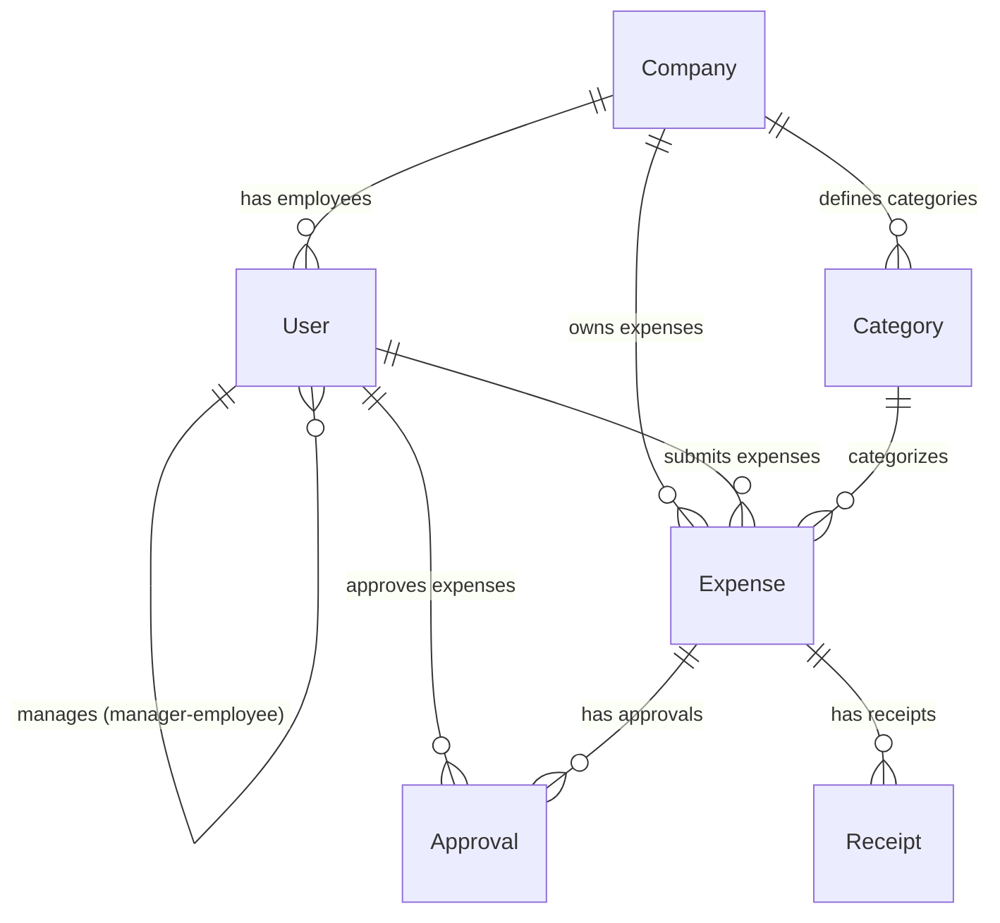

# Expense Management System 💼

A modern, automated expense management solution that streamlines reimbursement processes with intelligent approval workflows and OCR receipt scanning.


## 🚀 Overview

Companies often struggle with **manual expense reimbursement processes** that are time-consuming, error-prone, and lack transparency. Our solution provides:

- **Automated approval workflows** with multi-level sequencing
- **Flexible conditional rules** for smart approvals
- **OCR receipt scanning** for effortless expense submission
- **Multi-currency support** with real-time conversions
- **Role-based access control** for secure operations

## ✨ Features

### 🔐 Authentication & User Management
- **Complete signup flow** with company creation and profile setup
- **Auto-company creation** on first signup with country-based currency
- **Role-based access** (Admin, Manager, Employee)
- **Manager-employee relationships** for approval chains
- **Multi-step registration** with personal, company, and professional information

### 💰 Expense Submission
- **Multi-currency expense claims**
- **Category-based organization**
- **Real-time status tracking**
- **Receipt upload with OCR** (auto-fill expense details)

### 📊 Approval Workflows
- **Sequential multi-level approvals** (Manager → Finance → Director)
- **Conditional approval rules**:
  - Percentage-based (60% of approvers)
  - Specific approver rules (CFO auto-approval)
  - Hybrid combinations
- **Flexible rule engine** supporting complex scenarios

### 👥 Role-Based Permissions
| Role | Capabilities |
|------|-------------|
| **Admin** | Company setup, user management, rule configuration, override approvals |
| **Manager** | Team expense approval, visibility in company currency, escalation |
| **Employee** | Expense submission, personal history, status tracking |

## 🛠 Tech Stack

### Frontend
- **React 18** with TypeScript
- **Vite** for fast development
- **Tailwind CSS** for styling
- **Axios** for API communication
- **React Router** for navigation
- **Tesseract.js** for OCR processing

### Backend
- **Node.js** with Express.js
- **MongoDB** with Mongoose ODM
- **JWT** for authentication
- **Multer** for file uploads
- **Joi** for validation

### External APIs
- **Currency Data**: `restcountries.com`
- **Exchange Rates**: `exchangerate-api.com`
- **Cloud Storage**: AWS S3 (for receipt storage)

## 🚀 Quick Start

### Prerequisites
- Node.js 18+ 
- MongoDB 6+
- npm or yarn

### Installation

1. **Clone the repository**
```bash
git clone https://github.com/Priyanshu364911/Odooproject.git
cd Odooproject
```

2. **Backend Setup**
```bash
cd server
npm install
cp .env.example .env
# Configure your environment variables
npm run dev
```

3. **Frontend Setup**
```bash
cd client
npm install
cp .env.example .env
npm run dev
```

4. **Access the application**
- Frontend: http://localhost:5173
- Backend API: http://localhost:3000

### Environment Setup

**Backend (.env)**
```env
NODE_ENV=development
PORT=3000
MONGODB_URI=mongodb://localhost:27017/expense-management
JWT_SECRET=your-jwt-secret
CLOUDINARY_URL=your-cloudinary-url
```

**Frontend (.env)**
```env
VITE_API_BASE_URL=http://localhost:3000/api
VITE_APP_NAME=Expense Management
```

## 📁 Project Structure

```
expense-management/
├── client/                 # React frontend
│   ├── src/
│   │   ├── components/    # Reusable UI components
│   │   ├── pages/         # Route components
│   │   ├── hooks/         # Custom React hooks
│   │   ├── contexts/      # Auth and app contexts
│   │   ├── utils/         # Helper functions
│   │   └── types/         # TypeScript definitions
│   └── package.json
├── server/                # Express backend
│   ├── src/
│   │   ├── controllers/   # Route controllers
│   │   ├── models/        # MongoDB models
│   │   ├── routes/        # API routes
│   │   ├── middleware/    # Custom middleware
│   │   ├── services/      # Business logic
│   │   └── utils/         # Helper functions
│   └── package.json
├── shared/                # Shared types and utilities
└── README.md
```

## 📚 API Documentation

### Authentication Endpoints
- `POST /api/auth/signup` - Company and admin creation
- `POST /api/auth/login` - User authentication
- `GET /api/auth/me` - Get current user

### Expense Endpoints
- `POST /api/expenses` - Submit new expense
- `GET /api/expenses` - Get user's expenses
- `GET /api/expenses/approvals` - Get pending approvals
- `PUT /api/expenses/:id/approve` - Approve/reject expense

### User Management
- `POST /api/users` - Create users (Admin only)
- `GET /api/users/team` - Get team members

[View Full API Documentation](./API_DOCUMENTATION.md)

## 🎨 UI/UX Design

### Design System
- **Colors**: White background, green accents, deep black text
- **Typography**: Inter font family
- **Components**: Tailwind CSS with custom design tokens
- **Icons**: Lucide React icon library

### Key Screens
- **Dashboard**: Expense overview and quick actions
- **Expense Submission**: Form with OCR receipt upload
- **Approval Center**: Pending requests with bulk actions
- **Admin Panel**: User management and rule configuration

## 🚢 Deployment

### Production Build
```bash
# Build both client and server
npm run build

# Start production server
npm start
```

### Docker Deployment
```dockerfile
# Use provided Dockerfile
docker-compose up --build
```

### Environment-specific Configs
- **Development**: Hot-reload, debug tools
- **Staging**: Pre-production testing
- **Production**: Optimized builds, CDN assets


### Development Workflow
1. Fork the repository
2. Create a feature branch (`git checkout -b feature/amazing-feature`)
3. Commit your changes (`git commit -m 'Add amazing feature'`)
4. Push to the branch (`git push origin feature/amazing-feature`)
5. Open a Pull Request


## �️ Database Schema

The application uses MongoDB with Mongoose ODM. Below is the complete database schema with relationships and indexes.

### Core Models

#### User Model
```javascript
{
  _id: ObjectId,
  firstName: String (required),
  lastName: String (required),
  email: String (required, unique, lowercase),
  password: String (required, hashed),
  role: String (enum: ['admin', 'manager', 'employee']),
  company: ObjectId (ref: Company, required),
  manager: ObjectId (ref: User, nullable),
  department: String,
  position: String,
  phone: String,
  avatar: {
    url: String,
    publicId: String
  },
  preferences: {
    currency: String (default: 'USD'),
    notifications: {
      email: Boolean (default: true),
      expenseApproval: Boolean (default: true),
      statusUpdates: Boolean (default: true)
    }
  },
  isActive: Boolean (default: true),
  lastLogin: Date,
  resetPasswordToken: String,
  resetPasswordExpires: Date,
  createdAt: Date,
  updatedAt: Date
}
```

#### Company Model
```javascript
{
  _id: ObjectId,
  name: String (required),
  country: String (required),
  currency: String (required, default: 'USD'),
  admin: ObjectId (ref: User, required),
  approvalWorkflow: {
    enabled: Boolean (default: true),
    levels: [{
      level: Number,
      name: String, // Manager, Finance, Director
      rules: [{
        type: String (enum: ['percentage', 'specific_approver', 'hybrid']),
        percentage: Number (0-100),
        specificApprovers: [ObjectId] (ref: User),
        conditions: {
          minAmount: Number,
          maxAmount: Number,
          categories: [String]
        }
      }]
    }]
  },
  settings: {
    requireReceiptForExpenses: Boolean (default: true),
    autoApprovalLimit: Number (default: 0),
    allowMultiCurrency: Boolean (default: true)
  },
  isActive: Boolean (default: true),
  createdAt: Date,
  updatedAt: Date
}
```

#### Expense Model
```javascript
{
  _id: ObjectId,
  expenseNumber: String (unique, auto-generated),
  title: String (required),
  description: String,
  amount: Number (required, min: 0),
  currency: String (required, default: 'USD'),
  convertedAmount: {
    amount: Number,
    currency: String,
    exchangeRate: Number,
    convertedAt: Date
  },
  category: ObjectId (ref: Category, required),
  expenseDate: Date (required),
  submittedBy: ObjectId (ref: User, required),
  company: ObjectId (ref: Company, required),
  receipts: [{
    url: String (required),
    publicId: String (required),
    filename: String,
    size: Number,
    mimetype: String,
    uploadedAt: Date
  }],
  status: String (enum: ['draft', 'submitted', 'pending_approval', 'approved', 'rejected', 'reimbursed']),
  approvals: [{
    approver: ObjectId (ref: User, required),
    status: String (enum: ['pending', 'approved', 'rejected']),
    comments: String,
    approvedAt: Date,
    level: Number (required)
  }],
  currentApprovalLevel: Number (default: 1),
  tags: [String],
  merchant: {
    name: String,
    location: String
  },
  paymentMethod: String (enum: ['cash', 'credit_card', 'debit_card', 'bank_transfer', 'company_card']),
  reimbursement: {
    status: String (enum: ['pending', 'processed', 'completed']),
    method: String,
    referenceNumber: String,
    processedAt: Date,
    processedBy: ObjectId (ref: User)
  },
  metadata: {
    ocrProcessed: Boolean (default: false),
    ocrData: Mixed,
    ipAddress: String,
    userAgent: String
  },
  isActive: Boolean (default: true),
  createdAt: Date,
  updatedAt: Date
}
```

#### Category Model
```javascript
{
  _id: ObjectId,
  name: String (required),
  description: String,
  company: ObjectId (ref: Company, required),
  code: String (required, uppercase, auto-generated),
  color: String (default: '#3B82F6'),
  icon: String (default: 'Receipt'),
  isDefault: Boolean (default: false),
  settings: {
    requireApproval: Boolean (default: true),
    maxAmount: Number (min: 0),
    requireReceipt: Boolean (default: true)
  },
  isActive: Boolean (default: true),
  createdBy: ObjectId (ref: User, required),
  createdAt: Date,
  updatedAt: Date
}
```

### Relationships



### Database Indexes

#### User Collection
- `{ email: 1 }` - Unique login lookup
- `{ company: 1 }` - Company-based queries
- `{ manager: 1 }` - Manager hierarchy
- `{ role: 1 }` - Role-based filtering

#### Company Collection
- `{ admin: 1 }` - Admin lookup
- `{ name: 1 }` - Company search

#### Expense Collection
- `{ submittedBy: 1, status: 1 }` - User expense filtering
- `{ company: 1, status: 1 }` - Company expense overview
- `{ category: 1 }` - Category-based reports
- `{ expenseDate: -1 }` - Date-based sorting
- `{ expenseNumber: 1 }` - Unique expense lookup
- `{ company: 1, submittedBy: 1, status: 1 }` - Compound user queries
- `{ company: 1, expenseDate: -1 }` - Company timeline

#### Category Collection
- `{ company: 1, code: 1 }` - Unique category per company
- `{ company: 1, isActive: 1 }` - Active categories lookup

### Data Flow

1. **User Registration**: Creates Company → Creates Admin User → Sets up default Categories
2. **Expense Submission**: User creates Expense → Uploads Receipts → Triggers Approval Workflow
3. **Approval Process**: approvals based on Company workflow rules
4. **Reimbursement**: Approved expenses move to reimbursement processing

### Performance Considerations

- **Compound Indexes**: Optimized for common query patterns
- **Selective Fields**: Only necessary fields indexed to minimize storage
- **Aggregation Pipeline**: Used for dashboard statistics and reporting
- **Virtual Fields**: Computed fields like `fullName` and `approvalProgress`

## 🙏 Acknowledgments

- OCR technology powered by Tesseract.js
- Currency data from RestCountries API
- Exchange rates from ExchangeRate-API
- Icons by Lucide React

---
